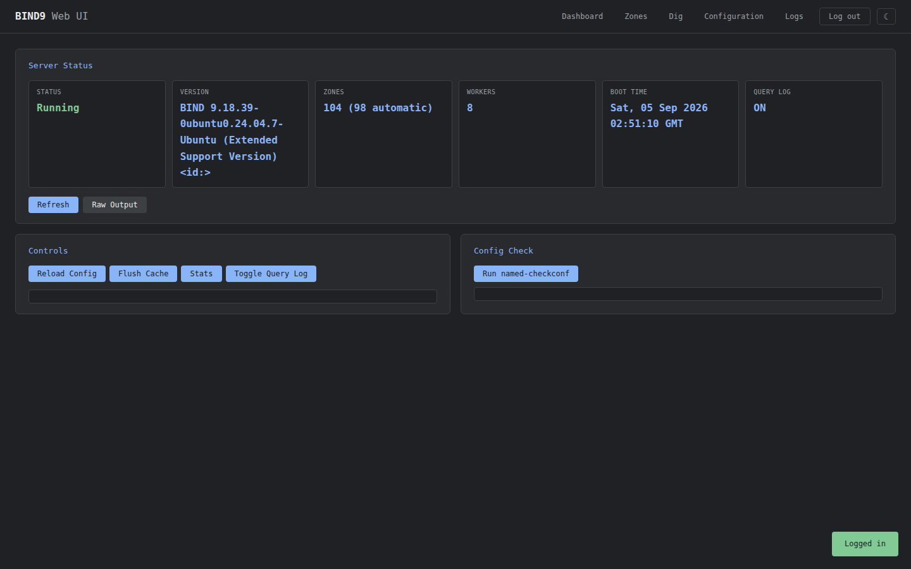

<div align="center">

```
 /$$       /$$                 /$$  /$$$$$$                                  /$$                 /$$
| $$      |__/                | $$ /$$__  $$                                | $$                |__/
| $$$$$$$  /$$ /$$$$$$$   /$$$$$$$| $$  \ $$         /$$  /$$  /$$  /$$$$$$ | $$$$$$$  /$$   /$$ /$$
| $$__  $$| $$| $$__  $$ /$$__  $$|  $$$$$$$ /$$$$$$| $$ | $$ | $$ /$$__  $$| $$__  $$| $$  | $$| $$
| $$  \ $$| $$| $$  \ $$| $$  | $$ \____  $$|______/| $$ | $$ | $$| $$$$$$$$| $$  \ $$| $$  | $$| $$
| $$  | $$| $$| $$  | $$| $$  | $$ /$$  \ $$        | $$ | $$ | $$| $$_____/| $$  | $$| $$  | $$| $$
| $$$$$$$/| $$| $$  | $$|  $$$$$$$|  $$$$$$/        |  $$$$$/$$$$/|  $$$$$$$| $$$$$$$/|  $$$$$$/| $$
|_______/ |__/|__/  |__/ \_______/ \______/          \_____/\___/  \_______/|_______/  \______/ |__/
                                                                                                    
                                                                                                    
                                                                                                    
```

### Control your BIND9 server from a modern web UI

**A lightweight, dependency-free web interface** that manages BIND9 (`named`) exactly like you do from the shell — zero rebuilding, zero reconfiguration, no database, ~32 MB RAM.

<!-- badges (static, no network lookups) -->


One command install, or run it from a container. Works with bare-metal BIND, a BIND container, or a remote `named` over rndc.

</div>

---

## Install — one line

Copy-paste this. No cloning, no setup — the installer bootstraps itself, then asks
which of the three deployments you want:

```bash
curl -fsSL https://raw.githubusercontent.com/himalsimkhada/bind9-webui/main/install.sh | bash
```

> Not ready yet? `./install.sh --check` does a safe dry run and reports what the
> installer would detect on your machine without changing anything.

---

## Table of Contents

- [Why bind9-webui?](#why-bind9-webui)
- [Features](#features)
- [Look & feel](#looks-like-this)
- [Install & quick start](#quick-start)
- [Requirements](#requirements)
- [Deployment options](#deployment-options)
  - [1. Full Docker stack](#option-1--full-docker-stack)
  - [2. Host BIND + Docker](#option-2--host-bind--docker)
  - [3. Manual (bare-metal)](#option-3--manual-bare-metal)
- [Configuration](#configuration)
- [Security notes](#security-notes)
- [API reference](#api-reference)
- [Development](#development)
- [Project structure](#project-structure)
- [How it works](#how-it-works)
- [License](#license)

---

## Why bind9-webui?

Managing BIND9 normally means SSH-ing in, remembering `rndc` incantations, and hand-editing zone files that are easy to get wrong. This project gives you a polished, single-page dashboard for the daily DNS chores — while **touching nothing** about how BIND runs underneath.

It deals only with the same config files and the same control channel real admins use (`rndc`, `named-checkconf`, `named-checkzone`). Your DNS setup stays yours; the UI just makes it pleasant.

---

## Features

| | |
|---|---|
| **Dashboard** | Live server state with stat boxes and the real `rndc` controls — reload, flush, stats, and querylog toggle. |
| **Zone management** | Master/detail workspace: searchable zone list, records panel, and a guided **Add Zone wizard** with a *Simple* tab (name, type, TTL, common-record presets, live zone-file preview) and an *Advanced* tab for pasting a raw zone file that gets validated with `named-checkzone`. |
| **Edit zones** | Add/remove records, open the raw zone file, `named-checkzone` it, delete it — all from the detail panel. |
| **Zone source control** | Move zones between `named.conf.local` and `named.conf.default-zones` in one click, with a protected flag for built-in system zones and the real filesystem path on display. |
| **Host Mapper** | Built into the Zones tab: paste `IP host1 host2 …` lines to bulk-create A records across existing zones, with duplicate and missing-zone reporting. |
| **Config editor** | Edit `named.conf`, `named.conf.options`, `named.conf.local`, `named.conf.default-zones` with full comment preservation. |
| **Backup & restore** | One-click download of all config + zones (+ rndc key) as a gzipped tarball; validated restore with a hard config gate and zone issues downgraded to warnings. |
| **DNS lookup (Dig)** | Run `dig` from the browser against the managed BIND. |
| **Log viewer** | Tail BIND logs with line-count control and text filtering. |
| **Validation** | `named-checkconf` / `named-checkzone` on demand, before and after edits. |
| **Access protection** | Shared password (`WEBUI_PASSWORD`), 30-minute *remember me* session auto-logout, log-out button, and brute-force lockout (5 failures → 15 min block). |
| **Dark & light mode** | Theme toggle, persisted in the browser. |
| **Feather-light** | Flask + vanilla HTML/CSS/JS. No build step, no Node.js, no database — ~32 MB RAM. |

---

## Looks like this

Real screenshot (dark mode) of a running instance:



---

## Quick start

Install in one command — the installer **bootstraps itself** when streamed, cloning the repo before it runs:

```bash
curl -fsSL https://raw.githubusercontent.com/himalsimkhada/bind9-webui/main/install.sh | bash
```

Or clone and run directly:

```bash
git clone https://github.com/himalsimkhada/bind9-webui.git
cd bind9-webui
./install.sh
```

You'll be asked which of three deployments you want:

```
  1) Full Docker stack   - BIND9 and the web UI both in containers
  2) Host BIND + Docker  - web UI container managing BIND on this machine
  3) Manual              - BIND and the web UI both directly on this machine
```

> **Dry run first:** `./install.sh --check` reports what the installer detects
> on your machine (distro, BIND config dir, log dir, rndc key, installed
> dependencies) without changing a thing.

---

## Requirements

- Linux with BIND9 installed (`apt install bind9 bind9-dnsutils`)
- Python 3.10+
- `sudo` access (for `rndc` and named config files)
- Docker is **optional** — needed only for the containerized deployments

Supported distros: Debian/Ubuntu (apt), RHEL/Fedora (dnf), Arch (pacman).

---

## Deployment options

The web UI runs against **either** a bare-metal BIND or an Ubuntu BIND container, **without code changes** — it talks to `named` through whichever transport you configure:

- **Local (bare-metal):** `rndc` over the local UNIX control socket, reading/writing `/etc/bind/`.
- **Remote (container or host over network):** `rndc` over TCP 953 with a shared `rndc.key`.

| Option | What runs where | When to pick it |
|---|---|---|
| **1. Full Docker stack** | BIND9 + web UI, two containers | You want zero DNS tooling on the host |
| **2. Host BIND + Docker** | Web UI in a container, BIND on the host | You keep your existing BIND, UI stays containerized |
| **3. Manual** | Everything on this machine, systemd service | Minimal footprint, single server |

### Option 1 — Full Docker stack

Two containers, one command: the official `ubuntu/bind9` image (port 53 UDP/TCP + TCP 953 for rndc) and this project's web UI (port 5000). They share `./docker/bind/` config and two named volumes (`bind-zones`, `bind-logs`); the UI drives BIND over `rndc -s bind9 -p 953`.

```bash
docker compose -f docker-compose-w-bind9.yml up -d --build
```

> **Production note:** a pre-generated `rndc.key` ships under `docker/bind/`.
> Regenerate it before exposing anything:
> ```bash
> rndc-confgen -a -c docker/bind/rndc.key && chmod 644 docker/bind/rndc.key
> ```

### Option 2 — Host BIND + Docker
Run only the web-UI image and point it at BIND that already runs on the host (or elsewhere). The compose file mounts the host's `/etc/bind` into the container and manages `named` over the rndc TCP channel:

```bash
./install.sh     # choose 2) Host BIND + Docker
```

The installer detects your OS and BIND config dir (`/etc/bind` on Debian/Ubuntu, `/etc/named` on RHEL/Arch), verifies BIND, adds a **restricted** rndc `controls` block, adds a file logging channel, writes `.env`, then `docker compose up -d --build`. Manually:

```bash
cp .env.example .env    # RNDC_HOST defaults to host.docker.internal
docker compose up -d --build
```

The compose file adds `extra_hosts: host.docker.internal → host-gateway`, so the container finds the Docker host automatically. If your Docker doesn't support `host-gateway`, set `RNDC_HOST` in `.env` to the host's LAN IP or the compose gateway.

> **TCP 953 is required** — a container can't reach the host's local rndc UNIX
> socket. If your `named.conf` doesn't expose it, add a **restricted** block
> (never `allow { any; }`):
> ```
> controls { inet 0.0.0.0 port 953 allow { 127.0.0.1; ::1; 172.16.0.0/12; } keys { "rndc-key"; }; };
> ```
> then `sudo systemctl restart named`. Also make sure the mounted `/etc/bind`
> contains the matching `rndc.key`. The `172.16.0.0/12` covers Docker's default
> bridge/compose subnetworks — tighten it if you prefer.

For the **Logs** tab, have the host BIND write a file so the mounted `/var/log/bind` has content to tail (`named.conf.options`):

```
logging {
    channel bind_webui_file { file "/var/log/bind/named.log" versions 3 size 5m; severity info; };
    category default { bind_webui_file; };
    category queries { bind_webui_file; };
};
```

### Option 3 — Manual (bare-metal)
Everything on this one machine, managed as a systemd service. Web UI at `http://localhost:5000`.

```bash
./install.sh     # choose 3) Manual
```

The installer detects your OS, installs BIND9 + Python deps if missing, prompts for the UI password, and installs the systemd unit. By hand:

```bash
sudo apt install bind9 bind9utils bind9-dnsutils python3-venv
sudo rndc-confgen -a
sudo chmod 640 /etc/bind/rndc.key && sudo chown root:bind /etc/bind/rndc.key
sudo systemctl start named

python3 -m venv venv
./venv/bin/pip install -r requirements.txt

WEBUI_PASSWORD='your-password' SECRET_KEY='a-long-random-string' ./venv/bin/python3 app.py
```

As a boot-starting service:

```bash
sudo cp bind9-webui.service /etc/systemd/system/
sudo systemctl daemon-reload
sudo systemctl enable --now bind9-webui
```

---

## Configuration

All web-UI container settings live in `.env` (see `.env.example`); bare-metal uses environment variables or the systemd `EnvironmentFile`:

| Variable | Default | Purpose |
|----------|---------|---------|
| `BIND_CONF_DIR` | `/etc/bind` | Directory with `named.conf*.local/.default-zones/options` |
| `ZONE_DIR` | `$BIND_CONF_DIR` | Where zone data files (`db.<zone>`) are written |
| `ZONE_OWNER` | *(empty)* | `user:group` to chown new zone files to (e.g. `bind:bind` in Docker) |
| `RNDC_HOST` | *(empty → local socket)* | Hostname/IP of a remote `named` over TCP (e.g. `bind9`) |
| `RNDC_PORT` | `953` | rndc TCP port when `RNDC_HOST` is set |
| `RNDC_KEY` | `$BIND_CONF_DIR/rndc.key` | rndc key file path |
| `LOG_FILE` | *(auto)* | Path to a BIND log file to tail (containers) instead of `journalctl` |
| `WEBUI_PASSWORD` | *(empty = auth off)* | Single shared password required to use the UI |
| `SECRET_KEY` | *(dev default)* | Secret used to sign the session cookie; set a random value |

> **Access protection:** set `WEBUI_PASSWORD` to require a password at login. The
> *Remember me* checkbox persists the session for **30 minutes** then auto-logs-out
> (otherwise the session ends when the browser closes). A **Log out** button lives
> in the nav bar. If the variable is empty, authentication is disabled entirely.

---

## Security notes

- Authentication is a single shared password compared against the configured `WEBUI_PASSWORD` — nothing stored on disk, no user database.
- Sessions use a signed cookie (set `SECRET_KEY`!), with **brute-force lockout** (5 failed logins → 15 min block) on the login form.
- rndc control channel is locked to loopback + private Docker subnets when the installer configures TCP.
- Restore writes go through the same validation gates BIND itself uses (`named-checkconf` / `named-checkzone`).
- No build step, no runtime downloads, no telemetry, no analytics.

---

## API reference

| Method | Endpoint | Description |
|--------|----------|-------------|
| GET | `/api/status` | BIND9 server status (raw) |
| GET | `/api/status/structured` | Server status (parsed key-value) |
| GET | `/api/zones` | List all zones |
| GET | `/api/zone/<name>` | Zone detail + records + path + source |
| POST | `/api/zone` | Create zone |
| DELETE | `/api/zone/<name>` | Delete zone |
| PUT | `/api/zone/<name>/file` | Update raw zone file |
| POST | `/api/zone/<name>/source` | Move zone between config files |
| POST | `/api/map-hosts` | Bulk-create A records from `IP host...` lines |
| POST | `/api/zone/<name>/record` | Add record |
| DELETE | `/api/zone/<name>/record/<idx>` | Remove record |
| GET | `/api/config/files` | List editable config files |
| GET | `/api/config/file/<name>` | Read config file |
| PUT | `/api/config/file/<name>` | Update config file |
| GET | `/api/config/check` | Run `named-checkconf` |
| GET | `/api/zone/<name>/check` | Run `named-checkzone` |
| GET | `/api/logs` | Query named logs |
| POST | `/api/control/reload` | rndc reload |
| POST | `/api/control/flush` | rndc flush |

---

## Development

```bash
python3 -m venv venv && source venv/bin/activate
pip install -r requirements.txt -r requirements-dev.txt

pytest                      # full suite (CI runs this too)
```

The suite covers zone create/edit/delete, config editing, backup/restore, dig,
auth + lockout, and the add-zone wizard (preview + raw validation). CI runs on
GitHub Actions for every push and PR.

---

## Project structure

```
bind9-web-ui/
├── app.py                  # Flask app — API routes + serves UI
├── bind_manager.py         # rndc commands + zone/config file parsing
├── templates/index.html    # Single-page dashboard
├── static/
│   ├── style.css           # Dark/Light theme CSS
│   └── app.js              # Vanilla JS (no build step)
├── tests/                  # pytest suite
├── requirements.txt        # flask
├── Dockerfile              # Container image for the web UI
├── docker-compose.yml      # Web-UI only (manages host/remote BIND over TCP rndc)
├── docker-compose-w-bind9.yml  # Full stack: BIND9 container + web UI
├── docker/bind/            # Config/rndc.key shared with the BIND container
├── install.sh              # bootstrapping one-shot installer (--check safe)
└── bind9-webui.service     # Systemd unit file
```

## How it works

The UI talks to BIND through the exact same tools an admin does:

- **`rndc`** — server control (reload, flush, stats, querylog); local UNIX socket on bare-metal, TCP 953 toward a container/remote BIND
- **Config files** — reads/writes `named.conf.local`, zone files under `/etc/bind` (or `/etc/named`)
- **`named-checkconf` / `named-checkzone`** — validation before writes land
- **`journalctl` / log file** — log viewing (containers tail `LOG_FILE`)

Transport is chosen from the environment: as a systemd service it uses the local
socket; inside a container it uses `RNDC_HOST` over TCP. No database. No magic.

---

<div align="center">

**Poke around, file an issue, open a PR — feedback welcome.**

</div>

## License

MIT